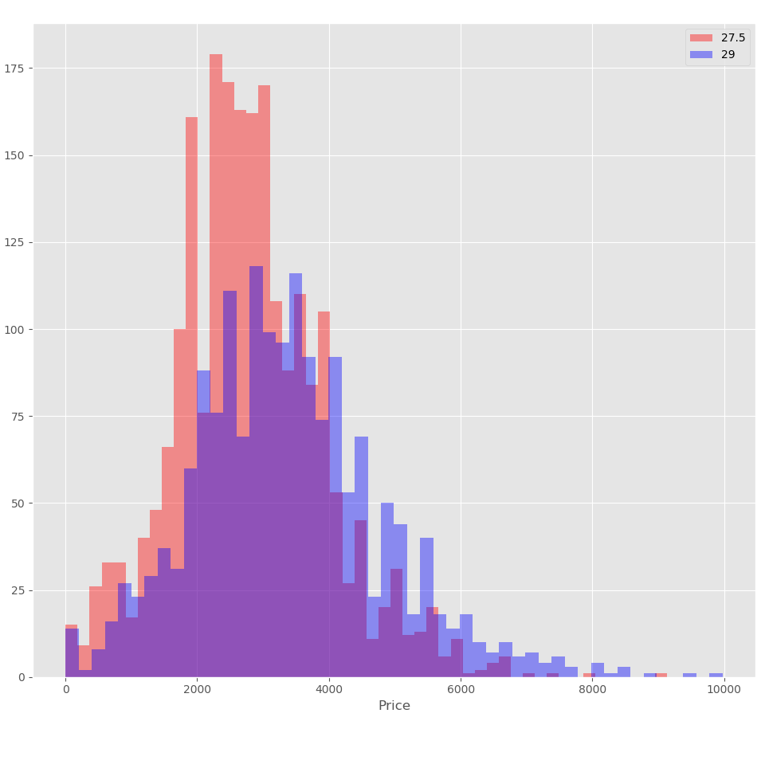

# Galvanize_Capstone_1
## Background
Wheather you are a passionate mountainbike racer or have just started, you know that mountain bikes are expensive. A new mountain bike that has high enough quality components to race is going to range from $4500-8000. This being said, you might think to buy a second hand bike. In the world of mountain bikes there are two wheeel sizes, 27.5"  and 29". The difference between these two is a trade-off between speed and manouverability. A 29" bike will be faster do to its ability to roll over obsticles due to a smaller angel of attack. A 27.5" bike is going to be what is called "flickable" it can change direction easily at the cost of speed. I want to know wheater a 29" wheel bike is worth morth than a 27.5" in the used bike market. 
## The Data
To answer this question I went to PinkBike.com's classifieds section where owners of mountain bikes can post their bike for sale to the mountain bike community. 

  

I web scraped PinkBike's classified tsection to get a data set. I extracted the following as the columns for my data.
<ul> 
    <li>Title
    <li>Condition
    <li>Wheel Size
    <li>Frame Material
    <li>Frame Size
    <li>Front Suspension Travel
    <li>Rear Suspension Travel
    <li>Asking Price

If the user didn't include all of the parameters teh data was not considered in the analysis. The total size of the dataset 
3,919 cleaned posts. Of which 1689 were 29" wheel bikes and 2230 were 27.5". 

  

And here are the first 10 postings of my listing. All prices were converted into the US dollar. 

  

## EDA

I started by making a histogram for each wheel size. Based off the histogram it looks like there may be some diference in the average value as the 29" wheel bikes appear to have a larger right tail but it is far from conclusive.

  

I applied the Central Limit Theroem and generated this plot

  

  

  

