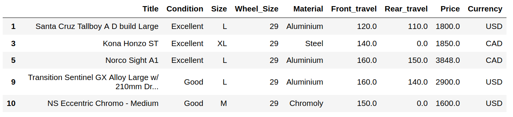
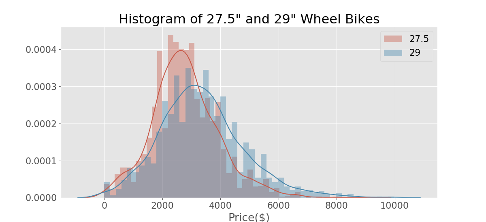
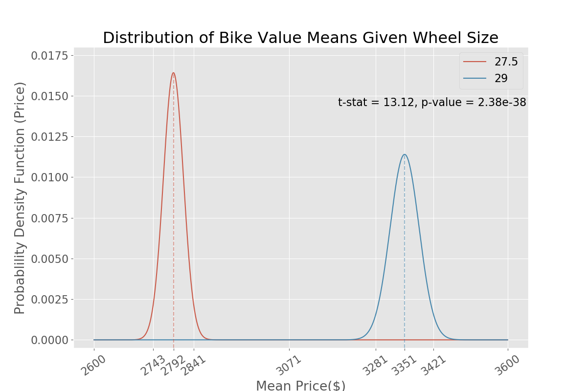
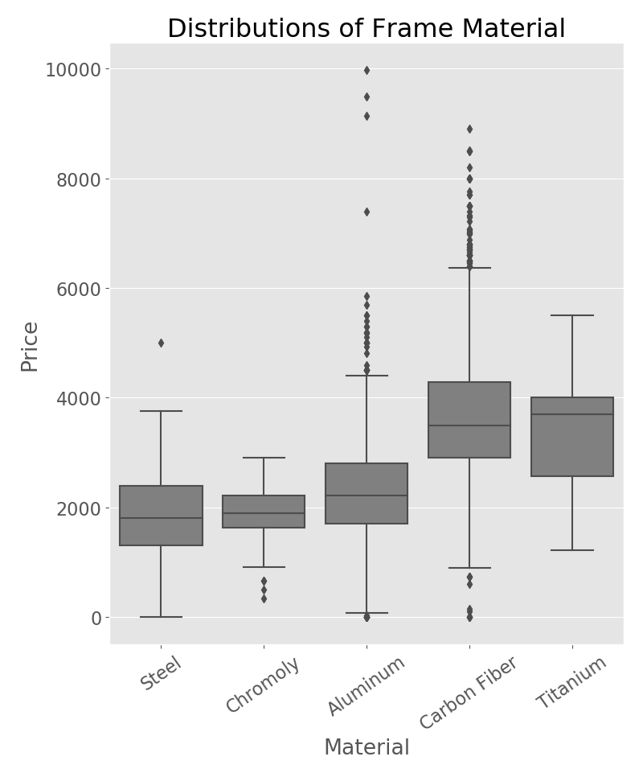

# Galvanize_Capstone_1
## Background
Whether you are a passionate mountain bike racer or have just started, you know that mountain bikes are expensive. A new mountain bike that has high enough quality components to race is going to range from $4500-8000. This being said, you might think to buy a second-hand bike. In the world of mountain bikes, there are two wheel sizes, 27.5"  and 29". The difference between these two is a trade-off between speed and maneuverability. A 29" bike will be faster, due to its ability to roll over obstacles. A 27.5" bike is going to be what is called, "flickable", it can change direction easily at the cost of speed. I want to know whether a 29" wheel bike is worth more than a 27.5" in the used bike market.

## Hypothesis
Based on my experience in the mountain bike community I suspect that mountain bikes with 29 in wheels will be worth more money in the used bike market. To prove this I will set up a hypothesis test where:
<ul>
    <li> H0: Means(price|29" wheels) = Means(price|27.5" wheels)
    <li> Ha: Means(price|29" wheels) > Means(price|27.5" wheels)
    <li> alpha = 0.05
</ul>

## The Data
To answer this question I went to PinkBike.com's classifieds section where owners of mountain bikes can post their bike for sale to the mountain bike community. 

  

I web scraped PinkBike's classified section to get a data set. I extracted the following as the columns for my data.
<ul> 
    <li>Title
    <li>Condition
    <li>Wheel Size
    <li>Frame Material
    <li>Frame Size
    <li>Front Suspension Travel
    <li>Rear Suspension Travel
    <li>Asking Price

If the user didn't include all of the parameters teh data was not considered in the analysis. The total size of the dataset was 3,919 cleaned posts. 

  

And here are the first 10 postings of my listing. All prices were converted into the US dollar. 

  

## EDA 
There were 2230 27.5" wheel bikes
There were 1689 29" wheel bikes. 

I started by making a histogram for each wheel size. Based off the histogram it looks like there may be some diference in the average value as the 29" wheel bikes appear to have a larger right tail but it is far from conclusive.

  

I applied the central limit theorem to the distributions above and calculated the standard deviation to get the components of the normal distribution. After plotting, the difference in these plots of means is clearly apparent. To further concrete my observations I applied the Welche's T-test to calculate a t-statistic and a p-value. I calculated a t-statistic of 13.12 and a p-value of 2.38e-38, therefore I can reject my null hypothesis and accept my alternative hypothesis and conclusively say that the mean price of 29" wheeled mountain bikes is greater than the mean price of 27.5" wheeled mountain bikes. 

  

The primary use of a bike is generally determined by the amount of suspension travel it has. This can be conceptualized by trying to ride a road bike down the stairs. It wouldn't be enjoyable but, and you wouldn't want to pedal a heavy bike with big tires 100 miles. By grouping by the amount of suspension travel 2 things become immediately obvious:
1. The more travel a bike has the greater the central tendency of the means of that group of bikes is higher.
2. Mountain bikes with 29" wheels had a higher central tendency across all travel lengths.

  

An interesting further investigation is that titanium bikes had a higher central tendency than carbon fiber bikes even though only a few manufacturers are making titanium bikes. 

  

## Conclusion
If you are in the used market for a high-end mountain bike you should expect to pay more for a 29er. A glass half full approach to that is: if you are in the market for a used mountain bike and you can live without the breakneck speeds of a 29er you could save yourself some money and still have a decent bike with a 27.5. 